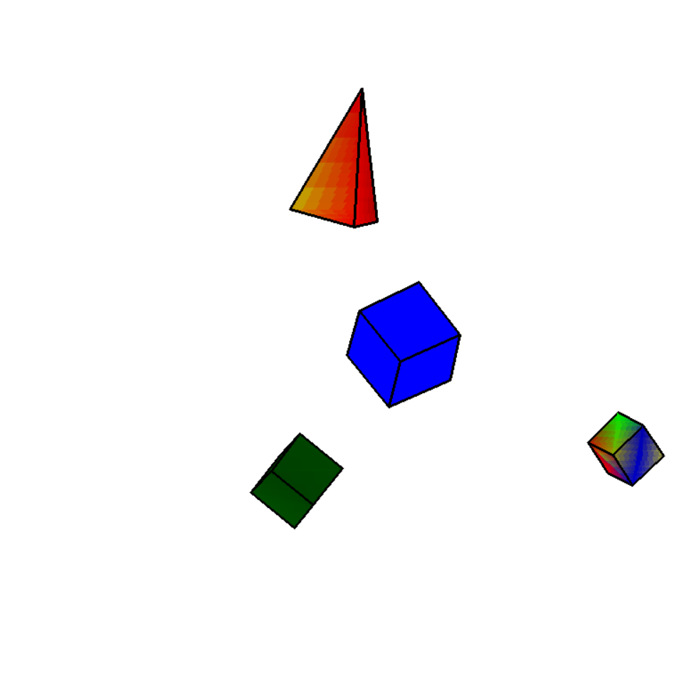

# 3D Renderer in Python with Pygame

## Description
This project is a simple 3D renderer implemented in Python using Pygame. It features the rendering of 3D objects (cube and pyramid) with rotation capabilities around all axes and around the center of the body. The renderer includes rasterization functionality with adjustable segment counts for performance optimization.

## Features
- Rendering of 3D objects (cube and pyramid)
- Rotation around all axes (X, Y, Z)
- Rotation around the center of the body
- Colorful entities with customizable colors
- Rasterization with adjustable segment counts for FPS optimization
- Backface culling (only visible faces are rendered)
- Moving the camer left, right, back and forward

## Installation
### Prerequisites
- Python 3.x
- pip 

### Clone the repo
```bash
   git clone https://github.com/boce1/3d_renderer.git
```

### Pygame Installation
To install Pygame, run the following command in your terminal or command prompt:
```bash
   pip install pygame
```

## Project Structure
1. body/ - **3D object definitions**
- cube/ **Cube implementation**
- pyramid/ **Pyramid implementation**
2. math3d/ **3D math operations**
- projection.py **Projection calculations**
- rotation.py **Rotation transformations**
- plane_vector.py **Visibility calculations**
3. point/ **Point class**
4. triangle/ **Triangle class**
5. constants/ **Render constants**
6. main.py **Main application entry point**


## Customization
Color and FOV can be cahanged in the **constants/** package

## Screenshot of what the renderer looks like


## Controls
1. W - move camera forward
2. A - move camera to the left
3. S - move camera backward
4. D - move camera to the right
5. LEFT_SHIFT - move camera down
6. SPACE - move camera up

#### TO DO: make demo video